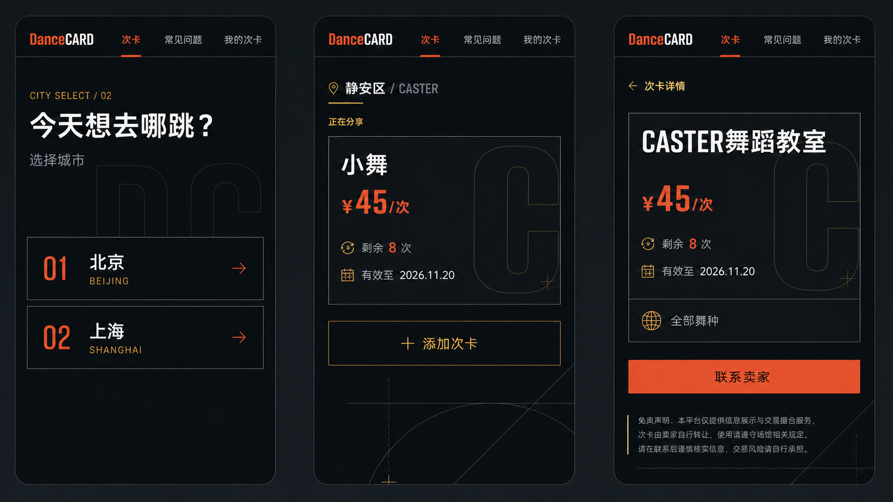

# DanceCARD

DanceCARD 是一个面向移动端的闲置舞蹈次卡信息交换工具。买家可以按照城市、行政区和舞室查找次卡，卖家可以发布剩余课时并提供微信联系方式。平台不处理支付、不担保交易，也不验证次卡信息。

DanceCARD is a mobile-first information exchange tool for unused dance-studio class cards. Buyers browse by city, administrative district, and studio; sellers publish remaining classes and provide a WeChat contact. The platform does not process payments, guarantee transactions, or verify listings.



## 项目状态 / Current Status

游客、卖家和管理员的 MVP 流程已经在 CloudBase 开发环境中实现。V1 以 H5 为正式发布目标；微信小程序目前可以成功构建并已通过开发者工具模拟器冒烟测试，但尚未提交或发布。正式公开上线前仍需准备生产环境、自定义域名及小程序合法请求域名、隐私政策、用户协议及专业法律审阅。

The guest, seller, and administrator MVP flows are implemented in a CloudBase development environment. H5 is the V1 release target. The WeChat Mini Program target builds successfully and has passed a Developer Tools simulator smoke test, but is not submitted or released. A production environment, custom and Mini Program legal request domains, privacy policy, user agreement, and professional legal review are still required before formal public launch.

## 技术架构 / Architecture

- **用户端 / User app:** Taro 4, React 18, TypeScript, Vite, NutUI Taro, SCSS
- **管理后台 / Admin app:** React, TypeScript, Vite, Ant Design
- **后端 / Backend:** Tencent CloudBase Auth, Node.js cloud functions, PostgreSQL
- **质量保障 / Quality:** ESLint, Prettier, Vitest, Testing Library, Playwright

```text
Taro 用户端 / User app ── H5 / WeChat ─┐
                                        ├─ CloudBase Auth + 云函数 / Functions ─ PostgreSQL
React 管理后台 / Admin app ── Web ──────┘
```

## 仓库结构 / Repository Layout

```text
apps/               用户端与管理后台 / User and admin applications
packages/           共享领域、校验和 API / Shared domain, validation, and API
cloudbase/          PostgreSQL 迁移 / Ordered PostgreSQL migrations
cloudfunctions/     受保护的后端函数 / Protected backend functions
database/           回滚、种子数据和 SQL 测试 / Rollbacks, seed data, and SQL tests
e2e/                Playwright 用户流程 / Playwright journeys
memory-bank/        产品、架构和交付决策 / Product, architecture, and delivery decisions
```

## 本地开发 / Local Development

需要 Node.js 22–24 和 pnpm 11。运行以下命令后，在本地环境文件中填写自己的 CloudBase 开发环境配置；不要提交真实凭据或用户数据。

Requires Node.js 22–24 and pnpm 11. After running the commands below, configure your own CloudBase development environment in the local environment files. Never commit real credentials or user data.

```bash
pnpm install
cp apps/user-app/.env.example apps/user-app/.env.local
cp apps/admin-web/.env.example apps/admin-web/.env.local
pnpm dev
```

## 验证 / Verification

提交改动前运行以下质量检查。Run these quality checks before submitting changes.

```bash
pnpm format:check
pnpm lint
pnpm typecheck
pnpm test:unit
pnpm test:e2e
pnpm --filter user-app build:h5
pnpm --filter user-app build:weapp
pnpm --filter admin-web build
```

产品行为以 [`memory-bank/Design-Document.md`](memory-bank/Design-Document.md) 为准，架构和安全边界记录在 [`memory-bank/architecture.md`](memory-bank/architecture.md)。

Product behavior is defined in [`memory-bank/Design-Document.md`](memory-bank/Design-Document.md). Architecture and security boundaries are documented in [`memory-bank/architecture.md`](memory-bank/architecture.md).

## 安全与隐私 / Security and Privacy

环境 ID 和客户端 API 地址可以公开，但数据库地址、短信凭据、维护令牌、私钥、管理员身份和真实用户记录不得进入 Git。报告安全问题前请阅读 [`SECURITY.md`](SECURITY.md)。

Environment IDs and client API endpoints may be public, but database URLs, SMS credentials, maintenance tokens, private keys, administrator identities, and real user records must remain outside Git. See [`SECURITY.md`](SECURITY.md) before reporting a vulnerability.

## 许可证 / License

本仓库尚未授予开源许可证。代码公开仅用于展示产品与工程过程；除非以后增加许可证，否则保留所有权利。

No open-source license has been granted. The repository is public for product and engineering transparency; all rights are reserved unless a license is added later.
